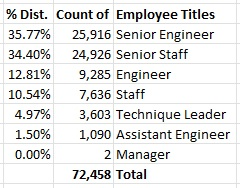
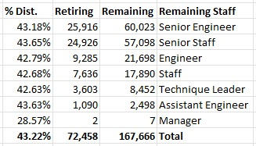
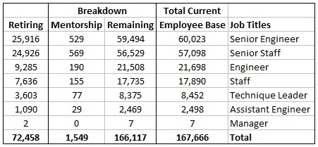

# Pewlett-Hackard Silver Tsunami

## Purpose: 
Pewlett-Hackard is soon to approach a “silver tsunami” of retiring senior level staff. The following data samples will help PH determine who is most likely to retire within the next few years as they approach 67 to 70 years of age. Finding those staff whom have been with PH for several decades can help assist with a knowledge transfer to the junior employees inside the corresponding departments to ensure the best possible transition. 
Out of the 240,124 current employee’s within Pewlett-Hackard, an estimated 72,458 employees (~30.2%) have the potential to retire in the coming years. Having access to this information will give PH ample time to create a mentorship program. 

## Analysis: 
Using the employee’s born between 1955 & 1952 (ages 67 and 70 respectively) who are still employed at PH a list was created to better manage the number of employees which are most likely to retire. This loss in company knowledge can lead to a disruption in productivity and productivity across multiple fields. This list can be found in the file “retirement_titles.csv” 

Next these specific employees were identified using their current job title to better plan which departments have the highest rate of retirement coming. Using the below breakdown, the groups for Senior Engineer and Senior Staff (~60%) will need the most focus following by the remaining Engineers and Staff. 

On Average each department has ~43% reduction in workforce. This allows for roughly 2 current employees to 1 retiring employee which can participate in the Mentorship program. 

Using a smaller subset of employees born in 1965 (1,549 employees who are 57 years old) can start the program to less the impact of work disruption. 

## Summary: 
If PH decides to use the smaller group of employees (1,549) then the overall employee impact who are no longer directly working in their job roles has lessened rather than take the entire current work staff. 

